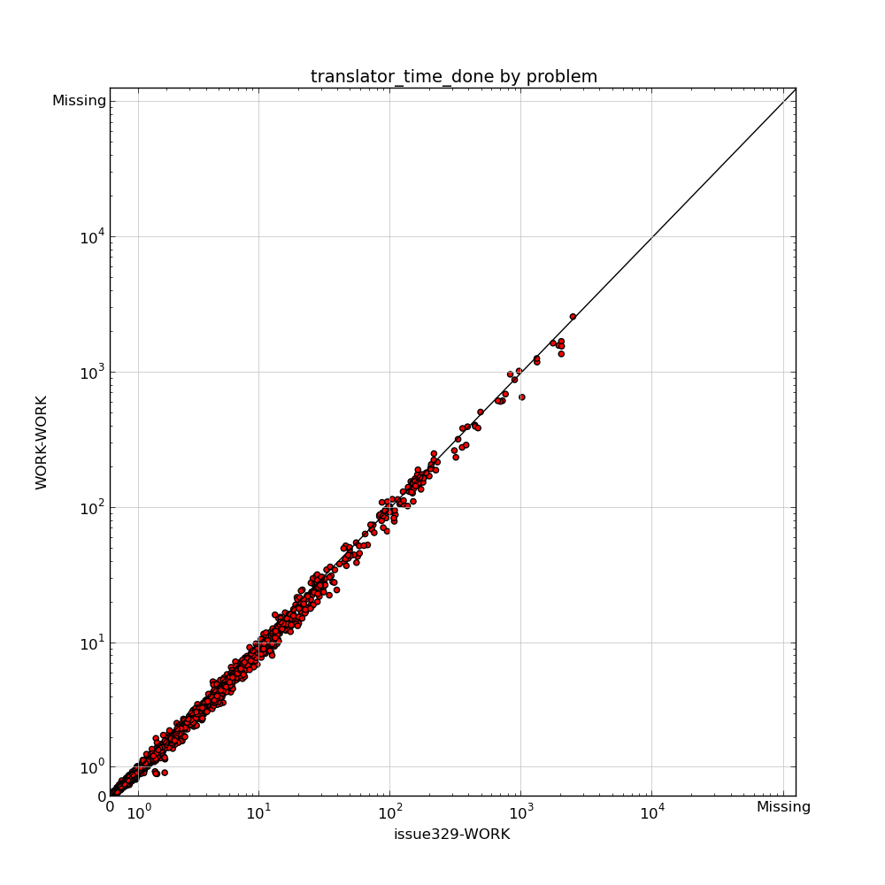

:mod:`downward.reports` --- Fast Downward reports
=================================================

Tables
------

.. autoclass:: downward.reports.PlanningReport
   :members: PREDEFINED_ATTRIBUTES, ERROR_ATTRIBUTES, INFO_ATTRIBUTES
.. autoclass:: downward.reports.absolute.AbsoluteReport
.. autoclass:: downward.reports.taskwise.TaskwiseReport
.. autoclass:: downward.reports.compare.ComparativeReport

Plots
-----

.. autoclass:: downward.reports.plot.PlotReport

.. autoclass:: downward.reports.scatter.ScatterPlotReport

